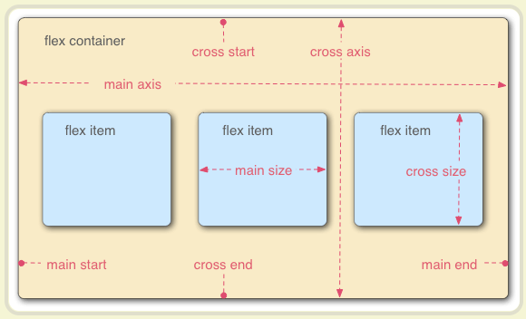
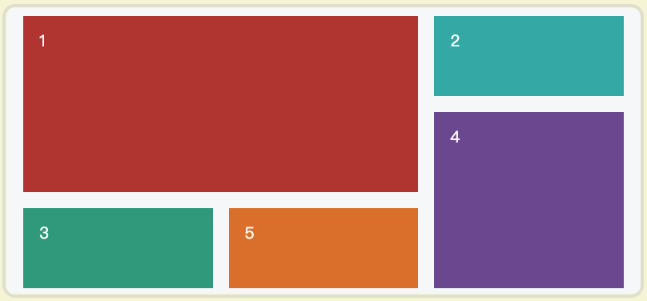

<Boxx/>

# 第一篇 
## 一.CSS的基本选择器，权重
1. ID选择器>Class选择器>伪类，伪元素选择器>元素选择器>全局选择器*{}
2. !import本身不属于选择器，而是针对选择器内的单一样式设置，以提高权重，在不同的选择器中
    使用!import的权重也是不一样的
3. 选择器是可以组合的，组合后权重可以叠加。
4. 内联样式的权重最高可以看为1000；id选择器权重为100；类，伪类，属性选择器的权重为10；
    元素选择器的权重为1。

## 二.CSS的引入方式
    内联式（行内式）>内嵌式（在在style里面）=外链式（通过link在头部引用）

## 三.link和@import的区别
1. 兼容性：
    * link属于html标签，没有兼容性问题；@import属于css范畴，不支持低浏览器版本。
2. 加载方式：
    * 通过link引用的css文件会在页面载入的同时加载，通过@import引入的css文件会在页面载入之后在加载。
3. 改变样式：
    * 通过link引用的css文件是DOM元素，支持javascript修改。@import引入的css文件不可以。
4. 加载资源的限制
    * link除了可以加载css文件还可以加载RSS等其他事务，例如加载模板。@import只能加载css文件
    
## 四.浮动引起的问题和解决办法
1. 引起问题：
* 父元素的高度无法被撑开，影响和父元素同级的元素。
* 与浮动元素同级的元素会紧随其后，可能会造成遮盖显现。
* 如果一个元素浮动那么他之前的元素也需要浮动，否则会造成串行现象。
2. 解决办法：
* 为父元素设置固定高度。
* 为父元素设置overflow:hidden。
* 用clear:both样式属性清除元素浮动。（如果只有左浮动可以直接用clear:left,如果只有左浮动可以直接用clear:right）
  注意：clear:both的使用地方有两个
  * 外墙法：在父元素外面设置clear:both
  * 内墙法：在父元素内部，浮动元素的后面设置clear:both
* 通过使用类clearfix :
```
.clearfix::after{
    content: '';
    display: block; 
    clear: both;
}
```

## 五.position的取值
1. relative: 相对定位，相对于他本身现在的位置进行定位，占据空间
2. absolute: 绝对定位，相对于父级元素，(向上寻找)，子绝父相，脱离文档流不占据空间
3. fixed: 固定定位，相对于浏览器的窗口是固定的，脱离文档流不占据空间
4. static: 默认定位，没有定位，元素正常的出现在文档流之中。
5. sticky: 粘性定位，容器的位置根据正常文档流计算得出。

## 六.position的absolute定位和float的区别
* absolute脱离文档流不占据空间。
* float脱离文档流但是还在文档结构之中占据空间。

## 七.个人用过的css选择器
* ID选择器
* Class选择器
* 伪类选择器：(a:hover,li:nth-child)
* 伪元素选择器：(li:before,li:after)
* 子选择器：div>p
* 兄弟选择器：div+p
* 后代选择器：div p
* 标签选择器：a img,ul li等
* 属性选择器：(button[disabled='true'])

## 八.css的继承
1. 可继承：
    *`font-size,font-family,color(a标签除外),text-align,text-indent`
2. 不可继承：
    *`border,padding,margin,width,height,背景属性,定位属性`

## 九.css的初始化
1. 原因：浏览器的兼容性问题，css的初始化可以解决页面在不同的浏览器出现的差异。
2. 解决：最简单的一种就是``` *{margin:0;padding:0}```

## 十.盒子水平垂直居中
1. 绝对定位法：
```
.box {
	width: 200px;
	height: 200px;
	border: 1px solid #000000;
	position: relative;
}
.chl_box {
	width: 100px;
	height: 100px;
	position: absolute;
	top: 0;
	left: 0;
	right: 0;
	bottom: 0;
	margin: auto;
	background: #00FFFF;
}
```
* 总结：
  * 给父元素设置宽高和position:relative
  * 给子元素设置position:absolute,将top,bottom,left,right全部设置为0.
  * 如只将top、bottom设置为0则垂直居中。只将left、right设置为0则水平居中
2. 负margin法：(传统方法)
```
.box {
	width: 200px;
	height: 200px;
	border: 1px solid #000000;
	position: relative;
}

.chl_box {
	width: 100px;
	height: 100px;
	position: absolute;
	top: 50%;
	left: 50%;
	margin-top: -50px;
	margin-left: -50px;
	background: #00FFFF;
}
```
* 总结：
  * 给父元素设置宽高和position:relative
  * 给子元素设置position:absolute,将top,left设置为50%。即top:50%,left:50%。
  * 向上和右移动宽高的一半。`margin-top: -(height/2)px;margin-left: -(width/2)px;`
3. 固定宽高法：
```
.box {
	width: 200px;
	height: 200px;
	border: 1px solid #000000;
}

.chl_box {
	width: 100px;
	height: 100px;
	margin: 50px 50px;
	background: #00FFFF;
}
```
* 总结：这种定位方法，得需要知道宽高，不灵活。
4. transform居中：
```
.box {
	width: 200px;
	height: 200px;
	border: 1px solid #000000;
	position: relative;
}

.chl_box {
	width: 100px;
	height: 100px;
	background: #00FFFF;
	position: relative;
	left: 50%;
	top: 50%;
	transform: translate(-50%,-50%);
}
```
* 总结：
  * 给父元素设置宽高和position:relative
  * 给子元素设置position:absolute,将top,left设置为50%。即top:50%,left:50%。
  * `transform:translate(-50%,-50%)`
  * 缺点IE9以下不支持
5. flex弹性布局：
```
.box {
	width: 200px;
	height: 200px;
	border: 1px solid #000000;
	display: flex;
	justify-content: center;
	align-items: center;
}

.chl_box {
	width: 100px;
	height: 100px;
	background: #00FFFF;
}
```
* 总结：
  * 给父元素设置:
  ```
  display: flex;
  justify-content: center;    /*水平居中*/
  align-items: center;   /*垂直居中*/
  ```
7. 不确定宽高
```
.box {
	width: 200px;
	height: 200px;
	border: 1px solid #000000;
	position: relative;
}

.chl_box {
	background: #00FFFF;
	position: absolute;
	left: 25%;
	right: 25%;
	top: 25%;
	bottom: 25%;
}
```
* 总结：
  * 给父元素设置宽高和position:relative
  * 给子元素设置position:absolute,将top,left,left,right全部设置为25%。
  
## 十一.双飞翼布局（两端固定，中间自适应）
```
<!DOCTYPE html>
<html>
	<head>
		<meta charset="utf-8" />
		<title>css</title>
	</head>
	 <style type="text/css">
	 	*{
	 		margin:0;
	 		padding: 0;
	 	}
	 	.main>div{
	 	 float: left;
	 	}
	 	.left {
	 		width: 200px;
	 		background: red;
	 		margin-left: -100%;
	 	}
	 	.right{
	 		width: 200px;
	 		background: blue;
	 		margin-left: -200px;
	 	}
	 	.middle{
	 		width: 100%;
	 		background: yellow;
	 	
	 	}
	 	.content{
	 		margin-left: 200px;
	 		margin-right: 200px;
	 	}
	 </style>
	<body>
	<div class="main">
		<div class="middle">
	 		<div class="content">
	 		中间
		 	</div>
		 </div>
		<div class="left">
			左边
		</div>
		<div class="right">
			右边
		</div>
	</div>
	</body>
</html>
```
* 总结：
  * 给左中右的三个div设置向左浮动
  * 给左右的两个容器设置固定的宽度例如200px
  * 给中间的容器设置` margin-left:200px;margin-right:200px`
  
## 十二.浅谈display:none,visibility:hidden,opacity=0
1.display:none.表示完全隐藏（可以理解为删除），脱离文档流，不占据空间，会改变页面布局
2.visibility:hidden 视觉隐藏，占据空间，不会改变页面布局，不会触发该元素绑定的事件
3.opacity=0，表示透明度为0，占据空间，不会改变页面布局，会触发该元素绑定的事件

## 十三.将超出宽度的字设置为省略号
```
{
  width:xxx;   /* 设置一个宽度 */
  overflow:hidden;
  white-space:nowrap;
  text-overflow:ellipsis
}
```

## 十四.px,em,rem
1. 相同点：三者都是表示长度单位
2. 不同点：
* px是固定值指定为多少就是多少，便于计算。
* em相对父级元素的字体大小默认1em=16px.
* rem相对于根元素（通常指的是html元素）的字体大小。

## 十五.css的content属性
* 专门用在before/after伪元素上面，用于插入生成的内容，最常见的的应用是利用伪类清除浮动。

## 十六.浅谈BFC
* 概念：块级格式化上下文
* 作用：创建的区域是一个独立的区域，不会收到上下元素的干扰
* 注意：在同一个BFC中，两个毗邻的块级元素在垂直方向上的margin会发生折叠

## 十七.margin塌陷
1. 形成条件：在正常情况下，父元素的高度默认是由子元素撑开的，此时给子元素设置浮动
2. 影响：导致父元素高度塌陷，此时给子元素设置margin-top不会生效，但是当margin-top超过一定限度
    就会带着父元素一起向下移动。
3. 解决方案：触发bfc，给父元素设置以下属性（其中之一就行）
* position:absolute
* display:inline-block
* float:left/right
* overflow:hidden

## 十八.margin合并
* 处于上下位置关系的两个块级元素，他们之间的距离是上容器的margin-bottom和下容器的margin-top之间
  的最大值。

## 十九.letter-sapcing 
* 增加或者较少字符之间的间距。正值表示增加，负值表示减少。

## 二十.常用的自适应单位
* 百分比：%
* em：相对于父级元素的字体大小默认为1em=16px.
* rem: 相对于根元素（html）的字体大小。
* vw:相对于视口宽度。
* vh:相对于视口高度
* vm:相对于视口宽度或者视口高度中的较小值

# 第二篇：CSS3
## 一.css3新增特性
* 圆角 border-radius
* 阴影 box-shadow
* 文字特效 text shadow
* 线性渐变 gradient
* 变换 transform
* 更多的选择器 
* 多背景设置
* 色彩模式 rgba()
* 媒体查询
* 多栏布局
* 图片边框 border-image

## 二.css3新增伪类
1. p:first-of-type  选择属于父元素的第一个p元素
2. p:last-of-type   选择属于父元素的最后一个p元素
3. p:first-child    选择属于父元素的第一个元素，这这里如果不是p元素则匹配不到
4. p:nth-child(2)   选择属于父元素的第二个元素，这这里如果不是p元素则匹配不到

## 三.transition和animation
1. 相同点：都是随着时间改变元素的属性值来实现动画效果。
2. 不同点：
    * transition着重在属性的开始和结束状态，不能实现比较复杂的动画效果。
    * animation着重在于帧的创建，通过@keyframes来定义多个帧。能实现比较复杂的动画效果。

## 四.animation的必要属性值
1. animation-name: 动画名称。
2. animation-duration: 动画的持续时间。

## 五.媒体查询
* 一般用于移动端，使用em,rem适配问题。通过不同的屏幕大小设置不同的font-size.以改变
  对应的em,rem
```
@media (min-width:320px){
  html{
    font-size:12px
  }
}
```

## 六.盒模型和怪异盒模型
1. 组成：`content+padding+border+margin`
2. 盒模型：` width=content的宽度,height=content的高度`
3. 怪异盒模型：` width=content+padding+border，height=content+padding+border` 
   * ``box-sizing:border-box``
   
## 七.css3动画的优缺点
1. 优点：
    * 性能好
    * 代码相对简单
2. 缺点：
    * 灵活度不够
    * 兼容性不好
    * 部分动画功能不能实现，不能实现复杂动画
    
## 八.flex布局
1. 概念：弹性布局，任何一个容器都可以指定为flex布局`display:flex;`,行内元素也可以`display:inline-flex`
2. 注意：设为flex布局之后，子元素的float,clear,vertical-align属性将消失
3. 两个轴：
    * 水平的主轴
    * 垂直的交叉轴

4. 属性：
    * flex-direction 属性决定主轴的方向（即项目的排列方向）,取值有:
        * row: 默认的，表示主轴为水平方向，起点在左端。
        * row-reverse: 主轴为水平方向，起点在右端。
        * column: 主轴为垂直方向，起点在上沿。
        * column-reverse: 主轴为垂直方向，起点在下沿。
    * flex-wrap  决定当一行排不下的时候怎么换行的
        * nowrap:  默认不换行
        * wrap：   换行，第一行在上面
        * wrap-reverse： 换行，第一行在下面
    * flex-flow  是flex-direction属性和flex-wrap属性的简写形式，默认值为row nowrap。
        flex-flow: row || nowrap
    * justify-content  属性定义了项目在主轴上的对齐方式。
        * flex-start: 左对齐（默认值）
        * flex-end: 右对齐
        * center: 水平居中
        * space-between: 两端对齐，间隔相等
        * space-around: 两侧对齐
    * align-items  属性定义项目在交叉轴上如何对齐。
        * flex-start: 上对齐
        * flex-end: 下对齐
        * center: 垂直居中
        * stretch: 默认值，如果项目未设置高度或设为auto，将占满整个容器的高度
        * baseline: 按照项目的第一行文字的基线对齐。
    * align-content 属性定义了多根轴线的对齐方式。如果项目只有一根轴线，该属性不起作用。
    * flex  属性flex-grow, flex-shrink 和 flex-basis的简写，默认值为0 1 auto。后两个属性可选。
        * flex: 0 1 auto (不放大,如果空间不足该项目将缩小,计算主轴是否有多余空间)
        * flex：auto (1 1 auto)
        * flex: none (0 0 auto)
        * flex: 1(让所有弹性盒模型对象的子元素都有相同的长度，且忽略它们内部的内容：)
 
## 九.grid布局
1. 概述：又称栅栏布局将整个网页划分成一个个网格，可以任意组合不同的网格，做出各种各样的布局。
2. 与flex布局的区别：flex布局只针对轴线的位置，可以看做是一维布局。grid布局是通过行和列的形式可以看做是二维布局。
3. 样式：

4. 说明：设为网格布局以后，容器子元素（项目）的float、display: inline-block、display: table-cell、vertical-align和column-*等设置都将失效。
5. 属性：
    * grid-template-columns 属性定义每一列的列宽
    * grid-template-rows 属性定义每一行的行高
```
定义一个三行三列的网格，列宽和行高都是100px。
方法一：
.container {
  display: grid;
  grid-template-columns: 100px 100px 100px;
  grid-template-rows: 100px 100px 100px;

方法二：
.container {
  display: grid;
  grid-template-columns: 33.33% 33.33% 33.33%;
  grid-template-rows: 33.33% 33.33% 33.33%;
}

方法三：简写形式
repeat(参数1，参数2)
参数1：表示要重复的次数
参数2：表示要重复的值
.container {
  display: grid;
  grid-template-columns: repeat(3, 33.33%);
  grid-template-rows: repeat(3, 33.33%);
}

fr 关键字
表示两列，每一列的宽度一样。如果两列的宽度分别为1fr和2fr，就表示后者是前者的两倍。
.container {
  display: grid;
  grid-template-columns: 1fr 1fr;
}

fr可以与绝对长度的单位结合使用，这时会非常方便。
.container {
  display: grid;
  grid-template-columns: 150px 1fr 2fr;  表示第一列列宽为150px,剩下的第三列宽度是第二列的两倍
}

minmax()函数产生一个长度范围，表示长度就在这个范围之中。它接受两个参数，分别为最小值和最大值。
grid-template-columns: 1fr 1fr minmax(100px, 1fr);

auto 关键字
auto关键字表示由浏览器自己决定长度。
grid-template-columns: 100px auto 100px;  左右两列是宽度为100px，中间自适应
```
5. 属性：
    * grid-row-gap 行间隔，
    * grid-column-gap 列间隔，
    * grid-gap 上面两个的合并写法 20px 20px
    * grid-auto-flow 属性，划分网格以后，容器的子元素会按照顺序，自动放置在每一个网格。默认的放置顺序是"先行后列"，即先填满第一行，再开始放入第二行，
        * grid-auto-flow:row 先行后列
        * grid-auto-flow:column 先列后行
        * grid-auto-flow: row dense;  先行后列，并且尽可能紧密填满，尽量不出现空格。
        * grid-auto-flow: column dense;  表示"先列后行"，并且尽量填满空格。
    * justify-items   水平对齐方式（在单元格内）
        * start    左对齐
        * center   水平居中对齐
        * end      右对齐
        * stretch  拉伸对齐
    * align-items   垂直对齐方式 （在单元格内）
        * start    上对齐
        * center   垂直居中对齐
        * end      下对齐
        * stretch  拉伸对齐
    * justify-content   水平对齐方式（整个内容区域）
        * justify-content: start | end | center | stretch | space-around | space-between | space-evenly(项目与项目的间隔相等，项目与容器边框之间也是同样长度的间隔);
    * grid-template-areas 属性用于定义区域
```
先划分出9个单元格，然后将其定名为a到i的九个区域，分别对应这九个单元格。
.container { 
  display: grid;
  grid-template-columns: 100px 100px 100px;
  grid-template-rows: 100px 100px 100px;
  grid-template-areas: 'a b c'
                       'd e f'
                       'g h i';
}
多个单元格合并成一个区域的写法如下。
下面代码将9个单元格分成a、b、c三个区域。
grid-template-areas: 'a a a'
                     'b b b'
                     'c c c';
```
## 十一.css兼容性问题
1. 文字本身的大小不兼容：同样大小的font-size例如14px在不同的浏览器下占据的空间是不一样的，ie下实际占高16px,火狐下实际占高17px(上下有留白导致)
    * 解决方案：给文字设定line-height
2. 火狐下容器高度限定问题，容器不会被内容撑大,ie下会被撑大
3. 可能会出现浮动无法清除现象
    * 解决方案：给li设置属性zoom:1
4. 通用的解决办法：
    * css初始化，在github上面下载normalize.css在main.js中引入
    * 浏览器的私有属性：
        * -moz代表firefox,内核为Gecko
        * -ms代表ie,内核为Trident
        * -webkit代表chrome,safari.内核为TBlink,Webkit
        * -o代表opera,内核为TBlink,
    * 自动化插件：Autoprefixer，是一款自动管理浏览器前缀的插件，它可以解析CSS文件并且添加浏览器前缀到CSS内容里。
    
## 十二.自适应布局
1. 媒体查询响应式页面
    * 移动端：`@media screen and (max-width:768px)`
    * iPad端：`@media screen and (max-width:992px) and (min-width:768px)`
    * pc端：`@media screen and (min-width:992px)`
2. Bootstrap的栅栏布局
    * 说明：Bootstrap框架下的一种布局方式。行必须放在.container class内。
    * 使用：
        * .col: 超小屏幕<576px
        * .col-sm: 576<小屏幕<768
        * .col-md: 768<中等屏幕<992  
        * .col-lg: 大屏幕>992  
        * .col-xl: 超大屏幕>1200
3. flex弹性布局
```
1. 一列固定,一列自适应
<div id="main">
    <div id="aside"></div>
    <div id="detail"></div>
</div>
#main{display:flex}
#aside{width:200px;height:400px}  固定的就设为固定宽度
#detail{flex:1;height:400px}   自适应设置flex:1就行，平分布局

2. 两列固定,一列自适应（双飞翼布局）
<div id="main">
    <div id="aside"></div>
    <div id="detail"></div>
    <div id="nav"></div>
</div>
#main{display:flex}
#aside{width:200px;height:400px}  固定的就设为固定宽度
#detail{flex:1;height:400px} 
#nav{width:200px;height:400px} 
``` 
4. 直接使用grid栅栏布局
```
.container {
  display: grid;
  grid-template-columns: 150px auto 150px;  表示第一列列宽为150px,剩下的第三列宽度是第二列的两倍
}
#aside{height:400px;background-color: red;}
#detail{height:400px;background-color: green;}
#nav{height:400px;background-color: blue;}
```