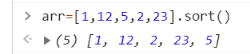

<Boxx/>

# 第一篇 
## 一.JavaScript概念
1. 是一种脚本语言（不具备开发系统的能力）。
2. 不用预编译，可以直接解析执行代码。
3. 弱语言（动态），较为灵活。
4. 运行在客户端浏览器上面。
5. 与操作系统无关，跨平台语言。
6. 使用领域:
    * 浏览器的平台化
    * Node.js 
    * 数据库操作
    * 跨移动平台
    
## 二.命名规则
1. 对大小写敏感。
2. 首字母可以是任意字母以及美元符号和下划线。
3. 剩余的可以是任意字母以及美元符号和下划线，数字。
4. 不能用关键字来命名例如：break,case,catch,class,const,continue...

## 三.变量类型
1. 基本类型：
    * number
    * string
    * 布尔值
    * null
    * undefined
    * symbol(es6新增的)
2. 数组类型：
    * Array
3. 对象类型:
    * Object
    
## 四.字符串
1. 字符串长度：str.length
2. 字符串索引：
    * [number] 表示第number+1个字符
    * charAt(number)和上一个差不多
    * charCodeAt()返回一个字符对应的二进制编码A-65,a-97
    * 注意：如果number是一个负数或者大于了字符串长度则返回NaN(not a number不是一个数字)
3. 字符串拼接：
    * str1.concat(str2)将str2拼接到str1后面 (数组的拼接也可以用concat不改变原数组)
    * 返回一个新的拼接后的字符串不会改变str1和str2
4. 字符串的创建：
    * var str='hello'
    * var str=new String('hello')
5. 字符串的截取：
    * str.substring(num1,num2)
        * 从num1截取到num2，num1包括，num2不包括。如果num1>num2.则会自动更换两者位置
    * str.substr(num1,num2)
        * 从num1开始截取，截取num2个长度。两个参数互换意思就不同了。
    * str.slice(num1,num2)
        * str.substring(num1,num2)一样,不同之处在于不能交换里面数字。
    * 注意：以上三种方法：如果省略了num2则都表示从num1开始一直截取到整个字符串结束。
6.字符串查找：
    * str.indexOf(str1,num)
        * 查找str1在str中首次出现的位置，如果查找失败则返回-1。num表示从左向右,从下标为num开始为可选参数
    * str.lastIndexOf(str1,num)
        * 查找str1在str中最后一次出现的位置，如果查找失败则返回-1。num表示从右向左。
7. 字符串替换：
    * str.replace(oldStr,newStr)  将第一个oldStr替换成newStr
    * 注意：replace并不会对原字符串产生影响，是生成了一个新的字符串。只会替换第一个，若想替换多个需要借助正则表达式。
8. 删除字符串两端空格：
    * str.trim()
    * 说明：并不会对原字符串产生影响，是生成了一个新的字符串
9. 大小写转换：
1. 大写转换：str.toUpperCase();生成一个新的字符串不会对原字符串产生影响。
2. 小写转换：str.toLowerCase();生成一个新的字符串不会对原字符串产生影响。
   
## 五.数组
1. 数组的创建：
    * var arr=[]
    * var arr=Array('','')
2. 字符串分割：
    * str.split(symbol)
    * 描述：根据指定的符号将字符串进行分割，并组成一个数组,不改变原来的str,只是返回了一个新的字符串数组
3. 数组删除：
    * delete arr[]
    * 描述：会改变原来的数组，长度不会发生改变，被删除的地方会被empty代替。
    
4. 数组的判断：
    * Array.isArray(arr);是数组返回true,不是返回false。
    * arr.valuePf();返回本身。
5. 把数组转化为字符串:
    * arr.toString()
    * arr.join(symbol) 以指定的符号将arr连接起来，生成一个字符串，不改变原数组。
6. 在数组尾部添加元素：
    * arr.push()
    * 描述：在数组的末尾添加一个元素，并返回新数组的长度，会改变原数组。
7. 删除数组的最后一个元素：
    * arr.pop()
    * 描述：删除并返回数组的最后一个元素，会改变原数组。
8. 在数组首部添加元素：
    * arr.unshift()
    * 描述：在数组的首部添加一个元素，并返回新数组的长度，会改变原数组。
9. 删除数组的第一个元素：
    * arr.shift()
    * 描述：删除并返回数组的第一个元素，会改变原数组。
10. 截断数组：
    * arr.slice(num1,num2)
        * 描述：从num1截断到num2（不包括）返回一个新的数组，不改变原数组,取值可以为负值，-1表示最后一个元素，以此类推，还是前包后不包。
                num2不写表示截到末尾。
    * arr.splice(a,b,c,d,...)
        * 描述：从下标为a开始截取b个元素，并用c,d,...来代替。a为必须参数。b不写表示截到末尾，会改变原数组。
11. arr.sort()
    * 按照编码的顺序对数组元素进行排序。
    

## 六.函数
1. 函数的声明：
    * function 函数名() {函数体}
        * 说明，具有隐式提升，函数调用可以放在前面
    * var fun=function()(){ 函数体 }
        * 说明，不具有隐式提升，函数调用不可以放在前面
    * var fun=new Function(){ 函数体 }
        * 不直观一般不用
  
2. 函数作用域：
    * 全局作用域：整个程序
    * 函数作用域（块级作用域）：作用在函数大括号内
    
3. 变量类型：
    * 全局变量：在全局作用域中通过var声明的变量
    * 局部变量：在块级作用域中通过var声明的变量

4. 对象的创建：
    * var obj={key:'value'}
    * var obj=new Object()
    * var obj=Object.create(null)
    
5. 对象的读取：
    * obj.key
    * obj['key']

6. 变量提升：
    * 通过var声明的变量会被提升到代码头部。
    ```
   console.log(num)
   var num=1;  // 结果为undefined
   等价于：
   var num;   // 变量提升了
   console.log(num)
   num=1
   ```

7. eval(sting)函数  :能够将字符串当做代码执行

8. instanceof  类型检测(复合数据类型，数组，对象等)
    * 例如：arr instanceof Array 判断arr是否是数组，如果是数组则返回true,否则返回false 
    
9. Math对象：
    * Math.E: 常数e=2.71828...
    * Math.PI: 圆周率pi=3.141592653...
    * Math.SQRT2: 2的平方根
    * Math.round(number)：四舍五入
    * Math.floor(): 向下取整
    * Math.ceil(): 向上取整
    * Math.pow(a,b): 以a为底b的幂次
    * Math.log(b): 以e为底b的对数
    * Math.exp(b): 以e为底b的幂次
    * Math.random(): 返回0-1之间的一个伪随机数，可能等于0但是一定小于1。生成多个可以用for循环
        * 生成m-n之间的随机数：Math.random()*(m-n)+m;  不包括n
        * 生成m-n之间的随机整数：Math.floor(Math.random()*(m-n)+m);  不包括n
        * 生成m-n之间的随机整数：Math.floor(Math.random()*(m-n)+1+m);   包括n

10. 日期对象：var date = new Date()
    * date.getFullYear():  获取年份
    * date.getMonth():  获取月份（加1得到实际月份）
    * date.getDate():   获取当前日
    * date.getHours():  获取小时
    * date.getMinutes():  获取分钟
    * date.getTime(): 获取毫秒
    * date.getDay(): 获取当前星期几

## 七.DOM
1. 定义：Document Object Model 即文档对象模型，是一套用来管理html文档的规则。
2. 常用dom节点属性
    * document.anchors: 返回页面中带有name属性的a标签的集合
    * document.querySelector('.class'): 返回类为class的节点，如果有多个则返回第一个
      可以是id选择器，元素选择器等。
    * document.querySelectorAll('.class'): 返回类为class的所有节点
    * document.ElementById(): 返回指定id的节点
    * document.ElementsByClassName(): 返回指定类名的节点
    * document.ElementsByTagName(): 返回指定标签属性的元素节点
    * document.ElementsByName(): 返回拥有name属性的html元素
    * document.createElement('标签名'): 创建一个标签，但是不会直接显示，需要配合appendChild(),removeChild()可以删除
 ``` 
  var p=document.createElement('p')   // 创建一个p标签
  p.innerHTML='内容'   // 往p标签里面添加内容
  document.body.appendChild(p)   // 将p标签添加到html的body中
 ```
* document.createAttribute('属性名')   创建元素属性值
* document.getAttribute('属性名')      获取元素属性值
* document.setAttribute('属性名')      设置元素属性值
* document.removeAttribute('属性名')   删除元素属性值

## 八.事件
1. 传递方式：
    * 事件冒泡：由最具体的元素开始，沿着DOM树逐级向上依次触发，直至最不具体的元素。
    * 事件捕获：由最不具体的元素开始，沿着DOM树逐级向下依次触发，直至最具体的元素。
    * 说明：事件冒泡和事件捕获是互逆的。
    * 阻止事件冒泡：event.stopPropagation()
    * 阻止事件默认行为：event.preventDefault()
    
2. html事件绑定：直接写在元素中。
    on+事件=函数()  例如： onclick=function(){}   // 这就是一个点击事件
    <button onclick='console.log('你好')'>   // 点击按钮打印'你好'

3. DOM0事件:
    * 绑定：button.onclick=function(){}  
    * 删除：button.onclick=null   

4. DOM2事件:
    * 绑定：div.addEventListener(type,function,布尔值)
    * 说明：
        * type:时间类型(不用加on),例如：click
        * function:监听函数
        * 布尔值：
            * true 代表事件捕获
            * false 代表事件冒泡（默认）
    * 移除：元素.removeEventListener(type,函数名，布尔值)
    
5. 鼠标事件：
    * 单击事件：div.onclick=function(){}
    * 双击事件：div.ondblclick=function(){}
    * 鼠标按下时触发：div.onmousedown=function(){}
    * 鼠标抬起时触发：div.onmouseup=function(){}
    * 鼠标移动时触发：div.onmousemove=function(){}
    * 鼠标移入时触发：
        * div.onmouseenter=function(){}    不冒泡
        * div.onmouseover=function(){}     冒泡
    * 鼠标移除时触发：
        * div.onmouseleave=function(){}    不冒泡
        * div.onmouseout=function(){}     冒泡
        
## 九.页面的加载
1. node.onload=function(){}     页面加载成功
2. node.onerror=function(){}    页面加载失败

## 十.this的指向
1. 描述：this代表函数运行时自动生成的代表函数调用者的对象，只能在函数内部使用。
2. 指向：
    * 在html事件中：指向window对象
    * 在DOM0事件：指向函数的调用者
    * 在DOM2事件：
        * IE下：指向函数的调用者
        * 非IE下：指向window对象
    * 间隔调用（setInterval）和延迟调用（setTimeout）：指向window对象
    * call/apply/bind: 第一个参数是什么就指向什么
    * 闭包：指向window对象
    * 自执行函数：指向window对象
    
## 十一.间隔调用和延迟调用
1. 间隔调用（setInterval），又名定时器，以间隔的时间多次的重复执行,异步的
    * 语法：
```
var timer=null;
timer=setInterval(function(){},时间间隔);  // 返回的timer是一个时间队列
clearInterval(timer)   //  当触发某个条件时清除这个定时器
```

2. 延迟调用（setTimeout）,延迟一定的时间再执行，只执行一次
    * 语法：
```
setTimeout(function(){},'时间间隔')
``` 

3. 用setTimeout来实现setInterval
``` 
// 方法一：
var timeFun=function(){
    var timer=setTimeout(function(){
        timeFun();
        clearTimeout(timer)
    },2000)
}
timerFun();

// 方法二：箭头函数
timeFun()=>{
    setTimeout(timeFun,1000)
};
timeFun()
// 本质上就是在setTimeout中继续执行外部函数
```

## 十二.页面优化
1. css放在html文档首部，js放在尾部
2. defer(推迟)
    * 语法：`<script src='' defer>`
    * 描述：等待DOM加载完成之后才会去加载js脚本，避免因为外部文件过大或者网络卡顿造成文件阻塞。
3. async(异步)
    * 语法：`<script src='' async>`
    * 描述：异步执行不必等上一个执行完毕再执行，提高效率
    * 弊端：无法知道DOM文件和外部的js文件谁先加载完成
4. 懒加载：当用户需要的是在加载呈现，可以有效的节约内存资源

## 十三.回流，重绘
1. 回流：当页面的全部元素或者部分元素的高度、宽度、位置、删除、增加或者隐藏、显示的时候
         页面的重新加载被称为回流，代价高昂。
2. 重绘：当页面发生一些可见性的变化例如：背景颜色等，不影响页面布局，此时页面的重新加载就称为重绘
3. 结论：回流必定引起重绘，重绘不一定引起回流。
4. 引起回流和重绘的原因：
    * 元素的宽高发生变化
    * 元素的位置发生了变化
    * 元素字体大小，颜色发生了变化
    * 脚本操作DOM
5. 减少回流和重绘提高浏览器性能
    * 在改变样式的时候尽量一次性写完
    * 读写的DOM尽量写在一块
    * 使用文档碎片
    * 使用fixed和absolute布局脱离文档流不占据空间。
    
## 十四.call(),apply(),bind()
1. call(参数一,参数列表):
    * 参数一：绑定给this,如果是null或者undefined则默认指向window
    * 参数列表
    * 例如：求数组的最大值
```
var arr=[1,4,3,5,78,65]
var max=Math.max.call(null,arr[0],arr[1],arr[2]...)
```
2. apply(参数一，参数二)：
    * 参数一：绑定给this,如果是null或者undefined则默认指向window
    * 参数二：是一个参数数组
    例如：求数组的最大值
```
var arr=[1,4,3,5,78,65]
var max=Math.max.apply(null,arr)
```
3. bind()():
    * 和call非常相似，只是返回的是一个函数
    * 例如：求数组的最大值
```
var arr=[1,4,3,5,78,65]
var max=Math.max.call(null,arr[0],arr[1],arr[2]...)();
``` 
4. 作用：都是在函数执行的时候，动态的改变函数的运行环境（执行上下文）

## 十五.闭包
1. 概念：在函数的内部定义一个函数，使其能够读取其他函数的内部变量。
2. 作用：读取其他函数的内部变量，是将函数内部和函数外部连接起来的桥梁。
3. 形成条件：函数嵌套
4. 特性：
    * 封闭性：外界无法访问闭包内部的数据，除非闭包主动向外界提供访问接口。
    * 持久性：一般函数在系统调用之后，系统会自动注销函数，对于闭包而言，在外部函数被调用之后
              不会被注销。
5. 优缺点：
    * 优点：延长外部函数局部变量的生命周期，可以实现一些类的继承
    * 缺点：占用的内存过多，容易造成内存泄漏
6. 注意事项：闭包的实际调用者都是window,所以所有闭包中的this指的都是window
7. 语法：
```
var fun1=function(){
    var num=999;
    fun2(){
        console.log(num);
        console.log(this)
    }
    return fun2
}
var res=fun1;
res();
```

## 十六.类和对象
1. 类的创建：通过构造函数加上new实例化来创建
2. 语法：
```
function 类名(对象的属性1,对象的属性2,...){
    this.公有属性1=公有对象的属性值1;
    this.公有属性2=公有对象的属性值2;
    ...
    var 私有属性1=私有对象的属性值1;
    var 私有属性2=私有对象的属性值2;
}
var 对像=new 类名(具体的属性值)
```
3. 封装和公私有
    * 描述：封装是指构造具有某种特征的类。
    * 特征：
        * 公有：对象中的属性和方法在对象的外部能够访问。
        * 私有：对象中的属性和方法在对象的内部能够访问。
    * 实现：
        * 公有：在构造函数中通过this.属性=属性值
        * 私有：在构造函数中添加局部变量或者闭包的方式来添加私有属性
4. 私有和公有的实现：
```
function People(pname,ability){
    this.pname=pname;
    this.ability=ability;

    // 用局部变量方式添加私有属性
    var secret = '梦开始的地方';

    // 特权函数
    this.getSecret=function (){
        console.log(secret)
    }
    
    // 通过原型的方式添加一些公有属性
    People.prototype.eyesNum=2
    People.prototype.breathe=function(){
        console.log('都要呼吸')
    }
}
// 实例化
var fun=new People('杜先生',function(){ console.log('敲代码')})

// 调用
fun.getSecret();              // 梦开始的地方
console.log(fun.pname);      // 杜先生
console.log(fun.eyesNum);    // 2
fun.breathe();               // 都要呼吸
fun.ability();               // 敲代码
```

## 十七.原型概述
1. 原型prototype：
    * 描述：是js为函数提供的一个对象类型属性，归函数所有所以不用创建。
    * 说明：向原型中添加的属性和方法能够被共同拥有
    * 不用手动添加，直接使用即可
    * 意义：原型的存在就是给类的对象添加公有属性，能够有效地节约内存空间
    * 注意：如果是通过类创建的对象，当访问的属性如果在对象中没有找到，则会去创建
            对象的类的原型中去寻找。
    * 缺点：原型中不能保存数组这类引用数据类型，因为地址传递的问题可能会导致出现修改的连锁变化。
2.  原型属性：原型是一个对象，在原型中通常拥有两个属性
    * 构造器constructor:该属性指向了这个类本身
    * 原型指向__proto__:该属性指向原型本身，提供给类创建的对象使用
3. 原型链：
    * 描述：每一个对象都可以有一个原型__proto__,这个原型还可以有自己的原型，以此类推形成一个原型链。
    * 作用：在访问对象的属性和方法的时候，首先在对象本身中查找是否拥有这个属性，如果没有就沿着原型链向上逐级查找
            直到查找到顶端object为止
    * 注意：原型链的顶端是一个object对象，没有__proto__属性，或者说__proto__属性就指向了object本身。

## 十八.继承
1. 原型链继承：
    * 特点：基于原型链，既是父类的实例也是子类的实例
    * 缺点：无法实现多继承
```
// 第一步：创建父类
function Father(){
}
Father.prototype.money='非常有钱'
var mayun=new Father()

// 第一步：创建子类
function Son(){
}
Son.prototype=mayun  // 让Son的原型指向Father
var beixi=new Son()
console.log(beixi.money)   // 非常有钱
```
2. 构造继承
    * 特点：可以实现多继承
    * 缺点：只能实现父类实例的属性和方法
3. 实例继承：为父类实例添加新特性，作为子类实例返回
4. 拷贝继承：拷贝父类元素上的属性和方法
5. 组合继承：结合了原型链和构造继承
    * 特点：既可以实现父类实例的属性和方法也可以实现原型上的属性和方法。
    * 缺点：生成两份实例
6. 寄生组合继承：
    * 特点：解决组合继承生成两份实例的弊端
    * 思想：通过寄生的方式砍掉父类
    
## 十九.Json
1. Json是js对象的字符串表示法，表示js对象的信息，本质上是一个字符串，任何一个js数据类型都可以用json来表示。
2. 一种轻量级数据交换格式
3. 前后端数据交换的纽带
4. Json方法：
    * Json.parse(后台传过来的数据)：把json字符串转换成js数据类型
    * Json.stringify(向后台传输数据)：把js数据类型转换成json字符串
5. 例如：`  var obj='{"name":"张三","age":"18"}'  `